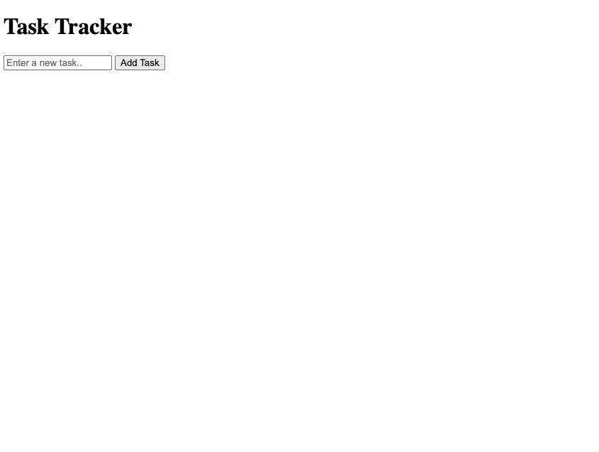
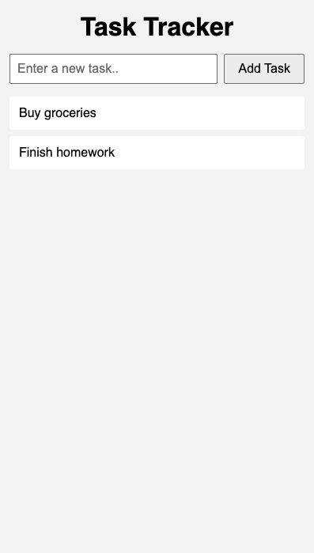
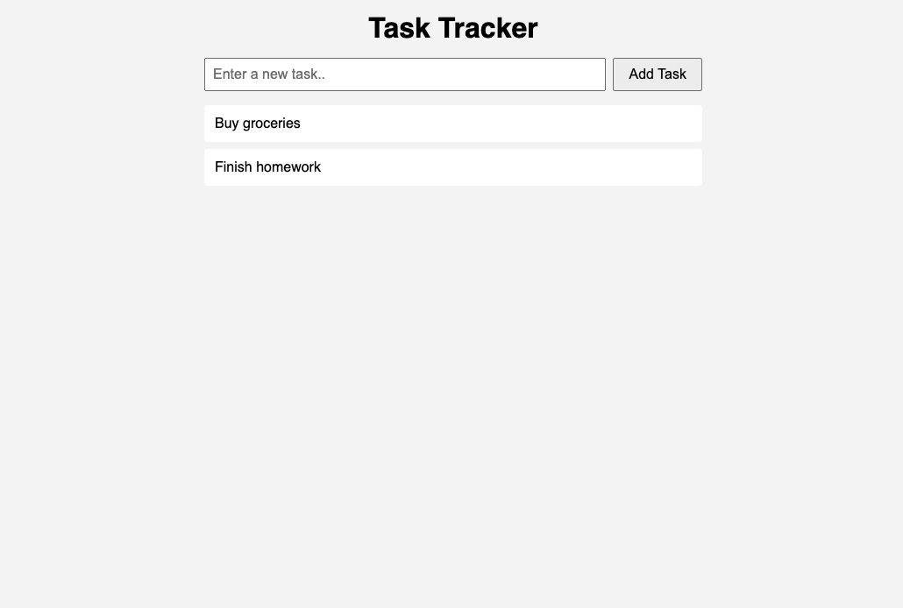

# Creating a Tracker

## Step 1: Define the HTML Structure

---

The first step is to define the HTML skeleton of the application. We use semantic HTML to make the structure clear and accessible. There are two main sections in the body of the webpage:

1. **Header**  
2. **Main Content**  
   - The main section is further divided into two parts:
     - The task input bar and button (`id="task-input"`)
     - The task list where added tasks will appear (`id="task-list"`)

The begginer body skeleton code and image is below:
 ```html
<body>
    <header>
        <h1>Task Tracker</h1>
    </header>

    <main>
        <section id="task-input">
            <input type="text" id="new-task" placeholder="Enter a new task..">
            <button id="add-task">Add Task</button>
        </section>

        <section id="task-list">
            <ul>
                
            </ul>
        </section>
    </main>
</body>
```

This is how it looks without styling:



## Step 2: Added Initial Styles

---

Below is the code for the initial styling. The goal is to create a clean, responsive design.

```css
*{
    box-sizing: border-box;
    margin: 0;
    padding: 0;
}

body {
    font-family: sans-serif;
    background-color: #f5f5f5;
    padding: 1rem;
}

header {
    text-align: center;
    margin-bottom: 1rem;
}

#task-input {
    display: flex;
    gap: 0.5rem;
    margin-bottom: 1rem;
}

#task-input input {
    flex: 1;
    padding: 0.5rem;
    font-size: 1rem;
}

#task-input button {
    padding: 0.5rem 1rem;
    font-size: 1rem;
    cursor: pointer;
}

#task-list ul {
    list-style: none;
}

#task-list li {
    background: white;
    margin-bottom: 0.5rem;
    padding: 0.75rem;
    border-radius: 4px;
}

/* Responsive tweak */
@media (min-width: 600px) {
    body {
        max-width: 600px;
        margin: 0 auto;
    }
}
```

At a high level, we are creating a layout that adapts to different window sizes.

We achieve this primarily by using `rem` units instead of `px`. In CSS, `rem` is a relative unit based on the root element's font size, which is typically set by the browser (usually 16px by default).

### Why use rem instead of px?
- **Accessible** – Scales with user's font size preferences
- **Responsive** – Automatically adjusts if root font size changes
- **Consistent** – All rem values scale proportionally together
- **User-friendly** – Respects users who increase font size for readability

### Media Queries

Another important piece is the media query below

```css
@media (min-width: 600px) {
    body {
        max-width: 600px;
        margin: 0 auto;
    }
}
```

This media query defines how the page should behave at a specific breakpoint. We use a mobile-first approach, so styles outside the media query apply to all screen sizes by default. When the viewport width is at least 600px (`min-width: 600px`), we limit the page content to a maximum width of 600px (`max-width: 600px`) and center it horizontally with `margin: 0 auto`. This prevents the content from stretching too wide on larger screens, maintaining readability and a clean layout.

**On a mobile device:**  
The layout stretches to fill the screen width, with comfortable padding and readable font sizes. All content remains easily accessible and adapts to smaller screens.


**On a larger screen (600px and up):**  
The content is centered on the page with a maximum width of 600px, preventing lines from becoming too long and keeping the interface tidy and readable.
**On a desktop or larger screen (600px and up):**  
The content is centered and does not exceed 600px in width, ensuring optimal readability and a visually balanced layout.


